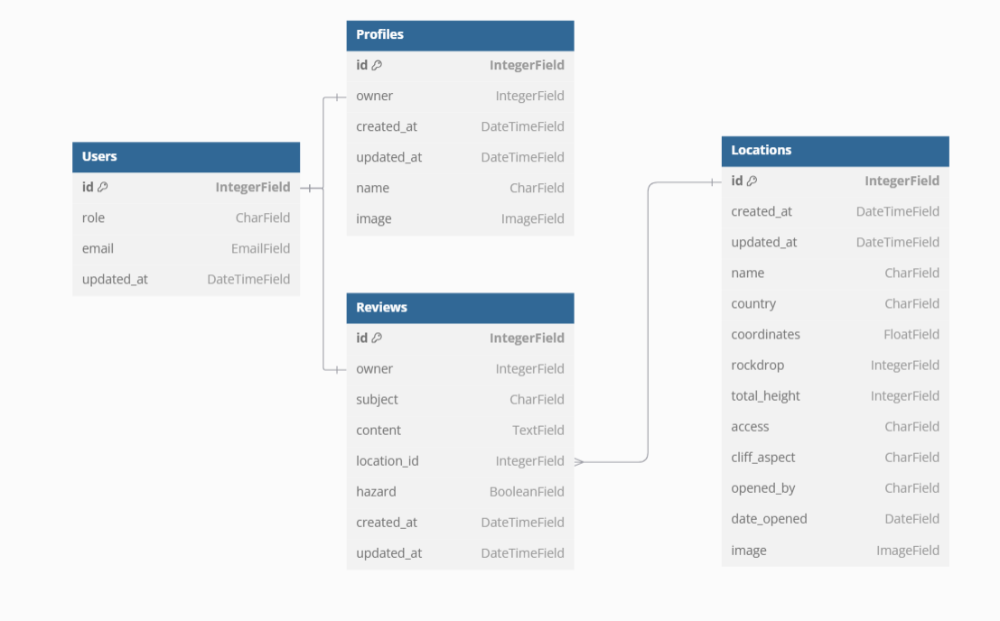

# Base Locations API

## Models Diagram

# Database Relationships

- **Users** and **Profiles** have a **one-to-one** relationship.
- **Users** and **Reviews** have a **one-to-many** relationship.
- **Locations** and **Reviews** have a **one-to-many** relationship.
