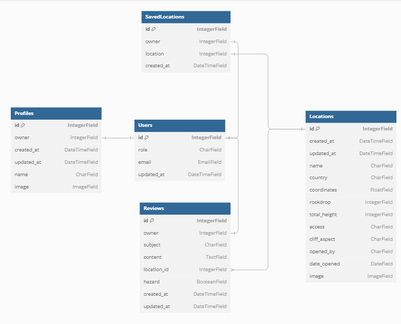

# Base Locations API

The BASE Locations API is a Django REST Framework backend that serves as a platform for the BASE jumping community. It manages location data for BASE jumping sites, including details like coordinates, heights, and access information. Users can create profiles, write reviews, and save their favorite locations, while location data itself is managed by superusers to ensure accuracy. The API features JWT authentication, image handling through Cloudinary, and comprehensive search and filtering.

## Models Diagram

**Additional**
The contact table was created to save contact form responses and has the fields
- id (integer)
- name (text)
- email (email)
- message (text)
- created_at (date)
- read (Boolean)



## Database Relationships

- **Users** and **Profiles** have a **one-to-one** relationship.
- **Users** and **Reviews** have a **one-to-many** relationship.
- **Locations** and **Reviews** have a **one-to-many** relationship.

## API Endpoints Table

| Endpoint | HTTP Method | Action | Authentication Required | Permission |
|----------|-------------|---------|------------------------|------------|
| `/` | GET | Root route with API welcome message | No | None |
| `/admin/` | GET | Django admin interface | Yes | Admin only |
| `/api-auth/` | GET | DRF authentication views | No | None |
| `/dj-rest-auth/logout/` | POST | Logout user and clear JWT cookies | Yes | Authenticated users |
| `/dj-rest-auth/` | Various | Authentication endpoints (login, user details, etc.) | Varies | Varies |
| `/dj-rest-auth/registration/` | POST | User registration | No | None |
| `/locations/` | GET | List all locations | No | Anyone |
| `/locations/` | POST | Create a new location | Yes | Superuser only |
| `/locations/<int:pk>/` | GET | Retrieve a specific location | No | Anyone |
| `/locations/<int:pk>/` | PUT/PATCH | Update a location | Yes | Superuser only |
| `/locations/<int:pk>/` | DELETE | Delete a location | Yes | Superuser only |
| `/profiles/` | GET | List all profiles | No | Anyone |
| `/profile/<int:pk>/` | GET | Retrieve a specific profile | No | Anyone |
| `/profile/<int:pk>/` | PUT/PATCH | Update a profile | Yes | Profile owner only |
| `/reviews/` | GET | List all reviews | No | Anyone |
| `/reviews/` | POST | Create a review | Yes | Authenticated users |
| `/reviews/<int:pk>/` | GET | Retrieve a specific review | No | Anyone |
| `/reviews/<int:pk>/` | PUT/PATCH | Update a review | Yes | Review owner only |
| `/reviews/<int:pk>/` | DELETE | Delete a review | Yes | Review owner only |
| `/saved-locations/` | GET | List user's saved locations | Yes | Authenticated user (own saves) |
| `/saved-locations/` | POST | Save a location | Yes | Authenticated users |
| `/saved-locations/<int:pk>/` | GET | Retrieve a specific saved location | Yes | Save owner only |
| `/saved-locations/<int:pk>/` | DELETE | Remove a saved location | Yes | Save owner only |
| `/contact/<int:pk>/` | DELETE | Remove a contact form response | Yes | Admin |
| `/contact/<int:pk>/` | GET | Marks message as read | Yes | Admin |
| `/contact/` | GET | Get list of form responses | Yes | Admin |
| `/contact/` | POST | Create a message for admins | No | Anyone |

</details>

## API Features

- Locations support filtering by country and searching by name/country
- Reviews can be filtered by location name and owner username
- Profiles can be searched by username
- Appropriate CORS headers are set up for frontend communication
- JWT authentication is used in production, while session authentication is used in development
- All list endpoints are paginated with 10 items per page

## API Endpoint images

<details>
<summary>Home endpoint</summary>


</details>

<details>
<summary>Locations</summary>


</details>

<details>
<summary>Reviews</summary>


</details>

<details>
<summary>Profiles</summary>


</details>

<details>
<summary>Contact</summary>


</details>

## Testing 

### Functional tests
Carried out alongside the front-end functional tests. If an event occurs that affects the API then the API URL is checked to see if the change has been reflected.

### Pep8
All pages were run through the official [Pep 8](https://pep8ci.herokuapp.com/#)
 validator to ensure all code was pep8 compliant. Some errors were shown due to blank spacing and lines too long, 1 line instead of 2 expected. All of these errors were resolved and code passed through the validator.

 Also the settings.py had a few lines with more than 79 characters, These were left since they are single string values.

### Technologies Used (DRF/API Specific)

**Django & Django REST Framework**
Django==3.2.4
djangorestframework==3.12.4
django-filter==2.4.0
django-cors-headers

**Authentication**
dj-rest-auth==2.1.9
django-allauth==0.53.0
djangorestframework-simplejwt==4.7.2
PyJWT==2.1.0
oauthlib==3.1.1
python3-openid==3.2.0

**Database**
dj-database-url==0.5.0
psycopg2==2.9.10
sqlparse==0.4.1

**Media Storage**
cloudinary==1.25.0
django-cloudinary-storage==0.3.0
pillow

**Security & Encryption**
cryptography==3.4.8
defusedxml==0.7.1

**HTTP & Requests**
certifi==2024.8.30
charset-normalizer==3.4.0
idna==3.10
requests==2.32.3
requests-oauthlib==1.3.0
urllib3==1.26.15

**Server**
gunicorn==23.0.0

**Python Utilities**
asgiref==3.8.1
cffi==1.17.1
packaging==24.1
pycparser==2.22
pytz==2021.1
setuptools==69.5.1
six==1.16.0

## Deployment

### Version Control

The site was created using the Visual Studio Code editor and pushed to github to remote repositories ‘base-forum’ for the UI and 'base-locations-api' for the API.

The following git commands were used throughout development to push code to the remote repo:

```git add <file>``` - This command was used to add the file(s) to the staging area before they are committed.

```git commit -m “commit message”``` - This command was used to commit changes to the local repository queue ready for the final step.

```git push``` - This command was used to push all committed code to the remote repository on github.

### Heroku Deployment

The site was deployed to Heroku. The steps to deploy are as follows:

**UI**
To deploy the UI do the same process for the API minus the config vars steps.

**API**
- Navigate to heroku and create an account
- Click the new button in the top right corner
- Select create new app
- Enter app name
- Select region and click create app
- Go to the settings tab and then click reveal config vars
- Add the following config vars to the API app:
  - ALLOWED_HOST: (Your allowed host)
  - CLIENT_ORIGIN: (Your client origin url)
  - SECRET_KEY: (Your secret key)
  - DATABASE_URL: (This should already exist with add on of postgres)
  - CLOUNDINARY_URL: (cloudinary api url)
  - DISABLE_COLLECTSTATIC: 1 

- Click the deploy tab
- Scroll down to Connect to GitHub and sign in / authorize when prompted
- In the search box, find the repository you want to deploy and click connect
- Scroll down to Manual deploy and choose the main branch
- Click deploy

The app should now be deployed.

The live link can be found here: [Live UI](https://base-forum-630b73fc7bab.herokuapp.com/) [Live API](https://base-locations-api-29bf40c34f1d.herokuapp.com/)

### Run Locally

Navigate to the GitHub Repository you want to clone to use locally:

- Click on the code drop down button
- Click on HTTPS
- Copy the repository link to the clipboard
- Open your IDE of choice (git must be installed for the next steps)
- Type git clone copied-git-url into the IDE terminal

The project will now have been cloned on your local machine for use.

### Fork Project

Most commonly, forks are used to either propose changes to someone else's project or to use someone else's project as a starting point for your own idea.

- Navigate to the GitHub Repository you want to fork.

- On the top right of the page under the header, click the fork button.

- This will create a duplicate of the full project in your GitHub Repository.